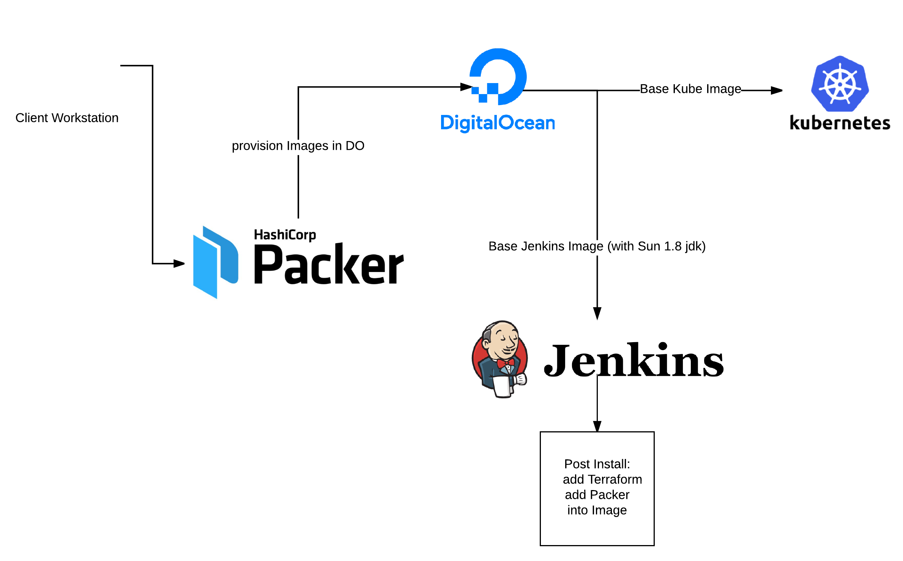
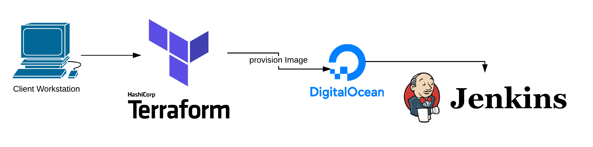

# kube-terraform-digital-ocean
Automated Provisioning of a Kube Cluster on Digital Ocean Using Jenkins with Terraform and Packer

This project is designed to show the process of using jenkins to provision a Kube cluster. (Not a production quality cluster)

It uses packer to build the jenkins and base kube image for digital ocean.

Once Jenkins is Launched in Digital Ocean it takes over as the builder and replaces the user workstation

The next process is to use terraform and the images created to build and provision the Kube cluster. To verify the proper running of the cluster a demo DB and web app are deployed.

This GIT repository is the main storage location for the provisioning and deployment of this Demo.

TODO: The master branch needs to be anonomised and an inital script needs to be build to take in required credentals to build the entire environment from scratch (digital ocean token & or ssh keys - we can generate all ssh-keys but for a demo with testing it is nice use to use an exisiting key on a workstation) 
